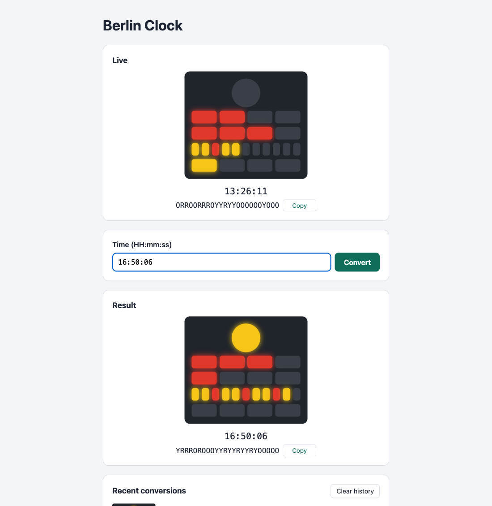

# Berlin Clock

[](https://github.com/malwal86/2026-CCE-E-DEV-010-BerlinClock/actions/workflows/ci.yml)

The [Berlin Clock kata](https://stephane-genicot.github.io/BerlinClock.html), built test-first as
vertical slices: **React UI → Spring Boot REST API → PostgreSQL**.

1. [What this is](#1-what-this-is)
2. [Quick start (Docker)](#2-quick-start-docker)
3. [Run natively](#3-run-natively)
4. [Run the tests](#4-run-the-tests)
5. [A 5-minute tour](#5-a-5-minute-tour)
6. [API](#6-api)
7. [Project structure and architecture](#7-project-structure-and-architecture)
8. [Technology choices, design decisions and scope](#8-technology-choices-design-decisions-and-scope)
9. [Troubleshooting](#9-troubleshooting)

## 1. What this is



Watch the current time tick on a live Berlin Clock, type a time to convert it, and find your earlier conversions
in a persisted history. All of the kata's Feature 1 ("Converting Digital Time to Berlin Time") is implemented, and
every example of its table is an automated test.

**For reviewers, in order:**

| Read | Why |
|---|---|
| This README | Run it, try every story in 5 minutes, see why each technology was chosen |
| [`docs/tdd-journey.md`](docs/tdd-journey.md) | Every story and kata scenario linked to the commits where its tests went red, then green |
| [`docs/Berlin-Clock-User-Stories.pdf`](docs/Berlin-Clock-User-Stories.pdf) | The plan: 13 user stories with acceptance criteria, traceability, decisions |
| `git log --reverse --no-merges` | One commit per layer per story; each body lists its red → green → refactor cycles |
| [`BerlinClock.java`](backend/src/main/java/com/kata/berlinclock/clock/BerlinClock.java) | The kata itself, in 65 lines of plain Java |

Delivery was organised as user stories, each one a full vertical slice you can try in the running app, each one a
pull request:

| Story | Pull request |
|---|---|
| A1 · Walking skeleton: convert a time, see the seconds lamp, find it in history | [#1](https://github.com/malwal86/2026-CCE-E-DEV-010-BerlinClock/pull/1) |
| A2 · Clear feedback for invalid times | [#2](https://github.com/malwal86/2026-CCE-E-DEV-010-BerlinClock/pull/2) |
| A3 · Five-hours row | [#3](https://github.com/malwal86/2026-CCE-E-DEV-010-BerlinClock/pull/3) |
| A4 · Single-hours row | [#4](https://github.com/malwal86/2026-CCE-E-DEV-010-BerlinClock/pull/4) |
| A5 · Five-minutes row | [#5](https://github.com/malwal86/2026-CCE-E-DEV-010-BerlinClock/pull/5) |
| A6 · Single-minutes row | [#6](https://github.com/malwal86/2026-CCE-E-DEV-010-BerlinClock/pull/6) |
| A7 · The entire Berlin Clock as one 24-character code | [#7](https://github.com/malwal86/2026-CCE-E-DEV-010-BerlinClock/pull/7) |
| B1 · Revisit a past conversion | [#8](https://github.com/malwal86/2026-CCE-E-DEV-010-BerlinClock/pull/8) |
| B2 · Clear the history | [#9](https://github.com/malwal86/2026-CCE-E-DEV-010-BerlinClock/pull/9) |
| C1 · Live clock ticking every second | [#10](https://github.com/malwal86/2026-CCE-E-DEV-010-BerlinClock/pull/10) |
| C2 · Resilience when the backend or database is unavailable | [#11](https://github.com/malwal86/2026-CCE-E-DEV-010-BerlinClock/pull/11) |
| D1 · Explorable API documentation | [#12](https://github.com/malwal86/2026-CCE-E-DEV-010-BerlinClock/pull/12) |
| D2 · Reviewer guide and TDD journey (this README, release `v1.0.0`) | [#13](https://github.com/malwal86/2026-CCE-E-DEV-010-BerlinClock/pull/13) |

## 2. Quick start (Docker)

Requirements: **Git** and **Docker** (Docker Desktop or Docker Engine with Compose v2). Nothing else: Java and
Node.js are only used inside the image builds.

```bash
git clone https://github.com/malwal86/2026-CCE-E-DEV-010-BerlinClock.git
cd 2026-CCE-E-DEV-010-BerlinClock
docker compose up --build
```

Then open **http://localhost:3000**. The first build downloads the base images and dependencies (a few minutes);
later ones take seconds.

| Service | URL | Notes |
|---|---|---|
| UI (nginx) | http://localhost:3000 | Proxies `/api` to the backend: one origin, no CORS |
| API (Spring Boot) | http://localhost:8080/api/conversions | |
| API docs (Swagger UI) | http://localhost:8080/swagger-ui.html | Try every endpoint; the contract is `/openapi.yaml` (also at `/v3/api-docs`) |
| PostgreSQL 17 | `localhost:5433`, db `berlin_clock`, user/password `berlin` | Host port 5433 avoids clashing with a local PostgreSQL |

Stop with `Ctrl+C`, or `docker compose down`. The history survives restarts. To wipe it, use **Clear history** in
the page or `docker compose down -v`.

## 3. Run natively

For development. Requirements: **JDK 21+**, **Node.js 22+**, **Docker** (for the database only).

```bash
docker compose up -d db                       # PostgreSQL on localhost:5433
cd backend  && ./mvnw spring-boot:run          # API on http://localhost:8080
cd frontend && npm ci && npm run dev           # UI on http://localhost:5173 (proxies /api to :8080)
```

Open **http://localhost:5173**. Database settings can be overridden with `DB_URL`, `DB_USERNAME` and `DB_PASSWORD`.

## 4. Run the tests

One command per app:

```bash
cd backend  && ./mvnw verify      # needs Docker running: tests use a real PostgreSQL via Testcontainers
cd frontend && npm test           # Vitest + Testing Library + MSW (npm run coverage for the report)
```

| Report | Where |
|---|---|
| Backend coverage | `backend/target/site/jacoco/index.html`. The build **fails** below 100% line and branch coverage of the `clock` package (the kata rules) |
| Frontend coverage | `frontend/coverage/index.html`, after `npm run coverage` |
| CI | GitHub Actions runs both on every push and pull request, and keeps the backend report as an artifact |

| Layer | Tooling | Tests |
|---|---|---|
| Domain (the kata) | JUnit 5, AssertJ, the kata tables verbatim as `@CsvSource`, a property check over all 86,400 seconds | `BerlinClockTest`, `SecondsLampTest`, `FiveHoursRowTest`, `SingleHoursRowTest`, `FiveMinutesRowTest`, `SingleMinutesRowTest`, `LampRowTest`, `LampTest`, `DigitalTimeTest` |
| Use case | JUnit 5 + in-memory history fake + fixed `Clock` | `ConversionServiceTest` |
| Persistence | `@JdbcTest` + Testcontainers PostgreSQL + Flyway | `JdbcConversionHistoryTest` |
| Web | `@WebMvcTest` + `MockMvcTester` | `ConversionControllerTest`, `LiveClockControllerTest` |
| API contract | `@WebMvcTest` + Atlassian OpenAPI validator: every documented answer, request and response checked against `openapi.yaml` | `ApiContractTest` |
| Acceptance (full stack) | `@SpringBootTest` + `RestTestClient` + Testcontainers | `ConversionApiAcceptanceTest`, `LiveClockApiAcceptanceTest`, `DatabaseDownAcceptanceTest` (stops its own PostgreSQL), `ApiDocumentationAcceptanceTest` |
| UI | Vitest, React Testing Library, MSW, fake timers for the live clock | `App.test.tsx`, `BerlinClock.test.tsx`, `LampRow.test.tsx`, `ClockCode.test.tsx`, `LiveClock.test.tsx` |

How the tests were written, step by step: [`docs/tdd-journey.md`](docs/tdd-journey.md).

## 5. A 5-minute tour

With `docker compose up` running, open http://localhost:3000. Each step names the story it checks.

**The clock (A1–A7)**

1. Type `00:00:00` and press **Convert** (or Enter). Only the round seconds lamp is lit, yellow (even second).
   *A1*
2. Type `23:59:59`. The seconds lamp is off (odd second), and every row is lit as far as it goes. *A1*
3. Type `16:35:00`: row 2, five hours, shows **three red lamps** (16 ÷ 5 = 3). *A3*
4. Type `14:35:00`: rows 2 and 3 read `RROO` / `RRRR`, 2 × 5 + 4 = 14 hours. *A4*
5. Type `12:35:00`: row 4 shows **Y Y R Y Y R Y**, seven blocks of five minutes, the quarters in red. *A5*
6. Type `12:34:00`: the bottom row lights four yellow lamps, 30 + 4 minutes. *A6*
7. Type `16:50:06`: under the clock, **`YRRROROOOYYRYYRYYRYOOOOO`**, the whole clock as the kata's 24-character code.
   **Copy** puts it on the clipboard. With VoiceOver (`Cmd+F5`), the clock reads *"Berlin Clock showing 16:50:06"*. *A7*

**Invalid input (A2)**

8. Type `24:00:00`, then `12-00-00`, then nothing. Each time the reason appears under the field (*"Invalid time
   '24:00:00': expected HH:mm:ss between 00:00:00 and 23:59:59"*, *"A time is required (HH:mm:ss)"*) and nothing is
   added to the history.

**The history (A1, B1, B2)**

9. **Recent conversions** lists the latest 10, newest first, each with its clock and code. Run
   `docker compose restart`, refresh: they are all still there. *A1*
10. Click `23:59:59` in the history. It opens in the **Result** panel and the address becomes `/conversions/<id>`.
    Reload, or paste the address into a new tab: the same conversion opens. **Back** and **Forward** follow. *B1*
11. Click **Clear history**. The page asks to confirm, with focus on **Cancel**. Click **Delete**: the list says
    *"No conversions yet"* and the result closes. *B2*

**Live clock and outages (C1, C2)**

12. The **Live** panel at the top shows your computer's time, ticking every second. DevTools → **Network**: one
    `GET /api/berlin-clock?time=…` per second, no `POST`, and the history does not change. *C1*
13. `docker compose stop db`, then convert a time: *"History is temporarily unavailable. Your conversion was not
    saved."* The live clock keeps ticking: it never uses the database. *C2*
14. `docker compose stop backend`: within ~2 s a banner says *"Backend unavailable. Retrying…"* and the live clock
    stays on its last time, dimmed. `docker compose start db backend`: everything comes back by itself. *C2*

**API documentation (D1)**

15. Open http://localhost:8080/swagger-ui.html → **POST /api/conversions** → **Try it out** → `{"time":"16:50:06"}` →
    **Execute**: `201` with a `Location`. The new entry is also in the page's history. *D1*

## 6. API

Every endpoint can be tried in **Swagger UI** at http://localhost:8080/swagger-ui.html. The contract is one
hand-written file, [`openapi.yaml`](backend/src/main/resources/static/openapi.yaml), also served at
http://localhost:8080/v3/api-docs. Errors are RFC 9457 `application/problem+json`.

| Endpoint | Success | Errors |
|---|---|---|
| `POST /api/conversions` body `{"time":"HH:mm:ss"}` | `201` + `Location` + conversion | `400` invalid or missing time · `503` database down |
| `GET /api/conversions` | `200` the latest 10, newest first | `503` database down |
| `GET /api/conversions/{id}` | `200` conversion | `404` unknown id · `503` database down |
| `DELETE /api/conversions` | `204` (idempotent) | `503` database down |
| `GET /api/berlin-clock?time=HH:mm:ss` | `200` clock, not saved | `400` invalid or missing time |

Copy-paste examples (through nginx on `:3000`; the backend answers the same on `:8080`):

```bash
# Convert a time: saved in the history
curl -i -X POST localhost:3000/api/conversions -H 'Content-Type: application/json' -d '{"time":"16:50:06"}'
# HTTP/1.1 201   Location: http://localhost:3000/api/conversions/12
# {"id":12,"time":"16:50:06","convertedAt":"2026-10-05T14:03:12Z","clock":"YRRROROOOYYRYYRYYRYOOOOO","seconds":"Y",
#  "fiveHours":"RRRO","singleHours":"ROOO","fiveMinutes":"YYRYYRYYRYO","singleMinutes":"OOOO"}

# An invalid time: nothing is saved
curl -i -X POST localhost:3000/api/conversions -H 'Content-Type: application/json' -d '{"time":"25:00:00"}'
# HTTP/1.1 400   Content-Type: application/problem+json
# {"detail":"Invalid time '25:00:00': expected HH:mm:ss between 00:00:00 and 23:59:59",
#  "instance":"/api/conversions","status":400,"title":"Invalid time"}

# The history, newest first
curl -s localhost:3000/api/conversions
# [{"id":12,"time":"16:50:06","convertedAt":"2026-10-05T14:03:12Z","clock":"YRRROROOOYYRYYRYYRYOOOOO",…}]

# One conversion again, and an unknown one
curl -s localhost:3000/api/conversions/12
# {"id":12,"time":"16:50:06","convertedAt":"2026-10-05T14:03:12Z","clock":"YRRROROOOYYRYYRYYRYOOOOO",…}
curl -s localhost:3000/api/conversions/999999
# {"detail":"Conversion 999999 not found","instance":"/api/conversions/999999","status":404,"title":"Conversion not found"}

# Clear the history
curl -s -X DELETE localhost:3000/api/conversions -o /dev/null -w '%{http_code}\n'
# 204

# Show a time without saving it (the live clock), and an invalid one
curl -s 'localhost:3000/api/berlin-clock?time=16:50:06'
# {"time":"16:50:06","clock":"YRRROROOOYYRYYRYYRYOOOOO","seconds":"Y","fiveHours":"RRRO","singleHours":"ROOO",
#  "fiveMinutes":"YYRYYRYYRYO","singleMinutes":"OOOO"}
curl -s 'localhost:3000/api/berlin-clock?time=24:00:00'
# {"detail":"Invalid time '24:00:00': expected HH:mm:ss between 00:00:00 and 23:59:59","instance":"/api/berlin-clock",
#  "status":400,"title":"Invalid time"}
```

With the database stopped, the four `/api/conversions` calls answer `503`:

```bash
curl -s -X POST localhost:3000/api/conversions -H 'Content-Type: application/json' -d '{"time":"12:00:00"}'
# {"detail":"History is temporarily unavailable. Your conversion was not saved.","instance":"/api/conversions",
#  "status":503,"title":"History unavailable"}
```

## 7. Project structure and architecture

```
 Browser ──► nginx :3000 ──┬─ /            static React build (index.html for any page)
                           └─ /api/*  ──►  Spring Boot :8080 ──► PostgreSQL :5432 (5433 on the host)
                                            │
             conversion/web ──► conversion/application ──► ConversionHistory (port)
                   │                    │                        ▲
             live (web only) ──────────►│                        │ implements
                                        ▼                 conversion/persistence (JdbcClient)
                                  clock (pure Java: the kata)
```

The code is packaged **by feature**, in the backend and in the frontend. Inside the `conversion` feature, layers
depend inwards only: `web` → `application` → `clock`, and `persistence` implements the `ConversionHistory` port that
`application` owns. The `clock` package has no Spring at all.

```
backend/                     Spring Boot 4.1 · Java 21
  src/main/java/com/kata/berlinclock/
    clock/                   Feature: Berlin Clock rules (BerlinClock, Lamp, LampRow) and the strict HH:mm:ss
                             input contract (DigitalTime), pure Java, no framework
    conversion/              Feature: conversion history, layered inside
      web/                   ConversionController, request/response DTOs, ConversionNotFoundException (404),
                             HistoryUnavailableHandler (503 when the database is down)
      application/           ConversionService use case, Conversion, ConversionHistory port
      persistence/           JdbcClient implementation of the port
    live/                    Feature: read-only GET /api/berlin-clock for the live clock (web layer only, no DB)
    error/                   ApiExceptionHandler: errors shared by every feature, as problem+json (500 for the unexpected)
    ApiDocumentationConfiguration         /v3/api-docs forwards to the hand-written openapi.yaml
    BerlinClockApplicationConfiguration   System Clock bean (JDK type, so declared with @Bean)
  src/main/resources/
    db/migration/            Flyway migrations (one: V1__create_conversion.sql)
    static/                  openapi.yaml (the API contract) and swagger-ui.html
frontend/                    React 19 · TypeScript · Vite
  src/clock/                 Feature: BerlinClock, LampRow and ClockCode components + lamp/row types
  src/conversion/            Feature: ConvertForm, RecentConversions, API client, /conversions/:id route, Conversion type
  src/live/                  Feature: LiveClock panel and the useLiveBerlinClock hook (one GET per second)
  src/App.tsx                Page: wires the features together
  nginx.conf                 Serves the build, proxies /api, short connect timeout
docs/                        User stories PDF, TDD journey, screenshot
docker-compose.yml           db + backend + frontend
.github/workflows/ci.yml     Backend verify (Testcontainers, coverage gate) + frontend lint, build, coverage
```

## 8. Technology choices, design decisions and scope

### Technology choices

Each choice was weighed against the obvious alternatives for an application this size: one small table, five
endpoints, one page. Where a heavier tool would bring features this app does not use, the lighter one won.

**Backend**

| Choice | Instead of | Why |
|---|---|---|
| **Java 21** | Java 17, Java 25 | The long-term-support release most widely available on build agents and runtime images. Records give immutable DTOs and value types (`Conversion`, `LampRow`) with no boilerplate, and text blocks keep SQL readable. |
| **Spring Boot 4.1** | Spring Boot 3.5 | 3.5's open-source support has ended; a new project should start on the supported line. It also brings `MockMvcTester` and `RestTestClient` (fluent, AssertJ-style web tests), built-in RFC 9457 `ProblemDetail`, and Jackson 3. |
| **Spring MVC** (servlets) | WebFlux | Simple request / response over a blocking JDBC driver. Reactive code would add complexity for no throughput need. |
| **Maven** (with the wrapper) | Gradle | Declarative, the most common build in Java teams, and `./mvnw` pins the version so nothing needs installing. |
| **Plain Java for the kata rules** (`clock` package) | Spring beans, a rules library | The rules are pure functions of a time. Without a framework they test in milliseconds and the 100% coverage gate means something. |
| **`JdbcClient`** (Spring JDBC) | JPA / Hibernate, Spring Data JPA, Spring Data JDBC | The whole persistence layer is one table and four statements: insert, latest ten, by id, delete all. An ORM's value is mapping object graphs and tracking changes; here there is no graph and nothing is ever updated, so Hibernate would add a persistence context, dirty checking, proxies, generated SQL and slower start-up, with no benefit, plus ORM surprises to watch for (N+1 queries, lazy loading, open-session-in-view). Spring Data repositories would add another abstraction over four queries. With `JdbcClient` the SQL is explicit and reviewable (`INSERT … RETURNING`, a deterministic `ORDER BY converted_at DESC, id DESC`), mapping to records is one method, and it is part of Spring already. The `ConversionHistory` port keeps it replaceable: an ORM adapter could be added later without touching the use case. |
| **PostgreSQL 17** | H2, MySQL | A production-grade database with exactly the types the data needs (`TIME(0)`, `TIMESTAMPTZ`, identity columns) and `RETURNING`. Tests run against the same engine as production, so there is no dialect drift (an H2 "PostgreSQL mode" is not PostgreSQL). |
| **Flyway** | Liquibase, Hibernate `ddl-auto` | Versioned migrations in plain SQL, which reviewers read as-is. Liquibase's XML / YAML changelogs abstract over databases we do not need to switch between, and `ddl-auto` lets an ORM change the schema implicitly. |
| **Testcontainers** | H2 in tests, a shared test database | Each test run gets a throwaway real PostgreSQL, migrated by Flyway, with nothing to install. `DatabaseDownAcceptanceTest` can even stop its own container to prove the 503 path. |
| **Hand-written `openapi.yaml`** + Swagger UI webjar | springdoc annotations | The contract is one readable file and the Java code carries no documentation annotations. Hand-written files can drift, so `ApiContractTest` validates every documented answer of the real controllers against it. springdoc was tried first ([`12fbe26`](https://github.com/malwal86/2026-CCE-E-DEV-010-BerlinClock/commit/12fbe26)) and replaced. |
| **JUnit 5, AssertJ, JaCoCo** | | The standard Java testing stack. JaCoCo's gate is on the `clock` package only: 100% is meaningful for pure rules; on wiring and DTOs it would only push for low-value tests. |

**Frontend**

| Choice | Instead of | Why |
|---|---|---|
| **React 19 + TypeScript** | Angular, plain JavaScript | A small component tree (clock, row, form, list) fits React well; TypeScript types mirror the API's JSON, so a field renamed on one side fails the build on the other. |
| **Vite** | Create React App, Next.js | CRA is deprecated. Next.js brings server rendering and routing this single static page does not need. Vite gives a fast dev server with an `/api` proxy and a static build nginx can serve. |
| **No UI library, one CSS file per component** | MUI, Tailwind, Bootstrap | The Berlin Clock's lamps are custom shapes no library provides, and the rest is one form and one list. Plain CSS keeps the bundle small and the look faithful to the real clock. |
| **No router library** | React Router | There is one dynamic address, `/conversions/:id`. A 10-line path helper plus `pushState` / `popstate` in `App` cover it. |
| **No state library, `fetch`** | Redux, React Query, axios | State is a handful of `useState` hooks in one page; `fetch` is built in. A library would be more code than the state it manages. |
| **Vitest + React Testing Library + user-event** | Jest, Enzyme | Vitest shares Vite's config and handles TypeScript and ES modules natively. Testing Library tests what a user sees and does (roles, labels, clicks), not component internals. |
| **MSW** (Mock Service Worker) | Mocking `fetch` or the API module | Tests intercept real HTTP requests, so the app's own API client code runs in every test. Its fake answers come from a table of kata results, so no Berlin Clock rule exists in the frontend, not even in tests. |
| **oxlint** | ESLint | Fast and works with almost no configuration (React hooks rules on). |

**Delivery**

| Choice | Instead of | Why |
|---|---|---|
| **Docker Compose** | Manual install steps | A reviewer needs only Git and Docker; one command starts database, API and UI. |
| **nginx** serving the build and proxying `/api` | Spring serving the frontend, CORS | One origin, so no CORS configuration, and the frontend always calls relative `/api`. The same proxy exists in dev (Vite). |
| **GitHub Actions** | | Runs the backend (Testcontainers, coverage gate) and the frontend (lint, build, tests) on every push and pull request; the badge above shows `main`. |
| **No browser end-to-end tests** (Playwright, Cypress) | | Full-stack acceptance tests over real HTTP and PostgreSQL, plus Testing Library tests of the page, cover the behaviour without a slow, flaky browser layer. Each story also has a human "Try it yourself" script. |

### Design decisions

- **All Berlin Clock logic lives in the backend `clock` package.** React only renders what the API returns.
- **The database stores facts only** (the input time and when it was converted). The Berlin Clock is computed
  on read, so there is one source of truth and no stale data, and older entries gained each new row as the stories
  landed, with no migration.
- **POST saves, GET reads.** `POST /api/conversions` returns `201 Created` with a `Location` header, and
  `GET /api/conversions/{id}` reads that conversion again (`404` problem detail when there is none).
  `DELETE /api/conversions` clears the history with `204 No Content`, and is idempotent.
- **The live clock sends the browser's time and saves nothing.** Every second the page asks the read-only
  `GET /api/berlin-clock?time=HH:mm:ss` for its own local time, so the rules stay in the backend and the server's
  time zone (UTC inside Docker) never matters. Ticks are not saved: one row a second per tab would bury the real
  history. Requests are numbered and an answer older than the one shown is dropped, so the clock never moves
  backwards; each tick is scheduled for the next whole second.
- **Say clearly when something is down, never show stale data as current.** The database down is a `503`
  problem detail (*"History unavailable"*), and a conversion that could not be saved says so. Anything unexpected is
  a `500` with no internals (it is logged instead). With the backend down, a banner appears and the live clock stays
  on its last time, dimmed, retrying every second. Timeouts are kept short so this shows within ~2 s (Hikari's
  connection timeout, nginx's proxy connect timeout); Flyway retries at start-up, so a late database does not stop
  the backend.
- **Strict input, checked in one place.** `DigitalTime` accepts only zero-padded `HH:mm:ss` from 00:00:00 to
  23:59:59 (`24:00:00` is rejected). The API takes the time as text so JSON binding cannot loosen the rule (Jackson's
  `LocalTime` accepts `12:00`), and an invalid time never reaches the database.
- **Errors are RFC 9457 problem details** (`application/problem+json`, with `title`, `status`, `detail`,
  `instance`). The UI shows `detail` as written: next to the time field for a `400`, under the form for anything else.
- **Rows travel in the kata notation** (`"fiveHours": "RRRO"`): one character per lamp, left to right. The UI's
  generic `LampRow` draws any row from it. The whole clock travels as `"clock"`, the kata's 24-character code.
- **The address matches the result.** Whatever the result panel shows lives at `/conversions/<id>`, so it can be
  shared, reloaded or reached with Back.
- **Accessible.** Each clock is one `role="img"` labelled *"Berlin Clock showing HH:mm:ss"*, its code is text with a
  copy button, errors are announced (`role="alert"`, `aria-invalid`), and destructive actions are confirmed inside
  the page with focus on **Cancel** (no browser `confirm()`).
- **Explicit Spring wiring.** Every bean declares itself with a stereotype (`@Service`, `@Repository`,
  `@RestController`) and an `@Autowired` constructor; `@Bean` is used only for the JDK's `Clock`.
- **TDD, committed per layer.** Each commit is green and lists its red → green → refactor cycles in its message; see
  [`docs/tdd-journey.md`](docs/tdd-journey.md).

### Scope

- **In scope:** the kata's Feature 1, "Converting Digital Time to Berlin Time", as in the challenge brief, behind a
  persisted conversion history and a live clock.
- **Out of scope, deliberately:** Feature 2, "Berlin Time to Digital Time" (not in the brief, and under-specified:
  one seconds lamp only says even or odd, so a code cannot give back `23:59:59`); users and authentication (the
  history is shared by everyone using the instance); editing conversions; pagination; internationalisation; cloud
  deployment; browser end-to-end tests.
- **Planned but not built:** `GET /api/conversions?limit=` (stories PDF, Appendix B). No story needed it; the API
  always returns the latest ten, and the contract documents only that.

## 9. Troubleshooting

| Symptom | Fix |
|---|---|
| `port is already allocated` / `address already in use` for **3000**, **8080** or **5433** | Something else uses the port (often a backend started with `./mvnw spring-boot:run`, or another app). Stop it (`lsof -nP -iTCP:8080 -sTCP:LISTEN` shows which), or change the left-hand port in `docker-compose.yml` |
| A local PostgreSQL on **5432** | No clash: the Compose database is published on **5433** on purpose |
| `role "berlin" does not exist` when running natively | You are connecting to another PostgreSQL. Use port **5433** (the default in `application.yml`) |
| Backend tests fail with *"Could not find a valid Docker environment"* | Start Docker (Docker Desktop on macOS / Windows); Testcontainers needs it for `./mvnw verify` |
| `Cannot connect to the Docker daemon` on `docker compose up` | Same: start Docker first |
| `release version 21 not supported`, or the backend fails to compile | Run `java -version`: JDK **21 or newer** is needed for native runs (newer JDKs compile with `--release 21`). Docker builds bring their own JDK |
| `npm ci` fails or the dev server will not start | Run `node -v`: Node.js **22 or newer** |
| **Apple Silicon** (M1–M4) | Works natively: every base image (`postgres:17-alpine`, `eclipse-temurin:21`, `node:22-alpine`, `nginx:1.29-alpine`) is multi-arch, so no emulation or `--platform` flag is needed. Checked on an arm64 Mac |
| The live clock shows *"Backend unavailable"* | The backend is still starting (it waits for the database) or stopped. It clears by itself once `docker compose ps` shows the backend up |
